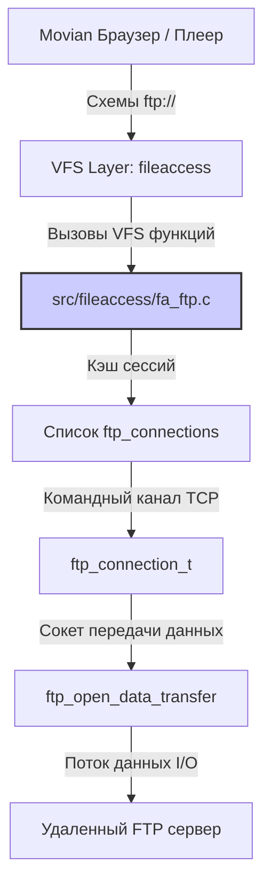
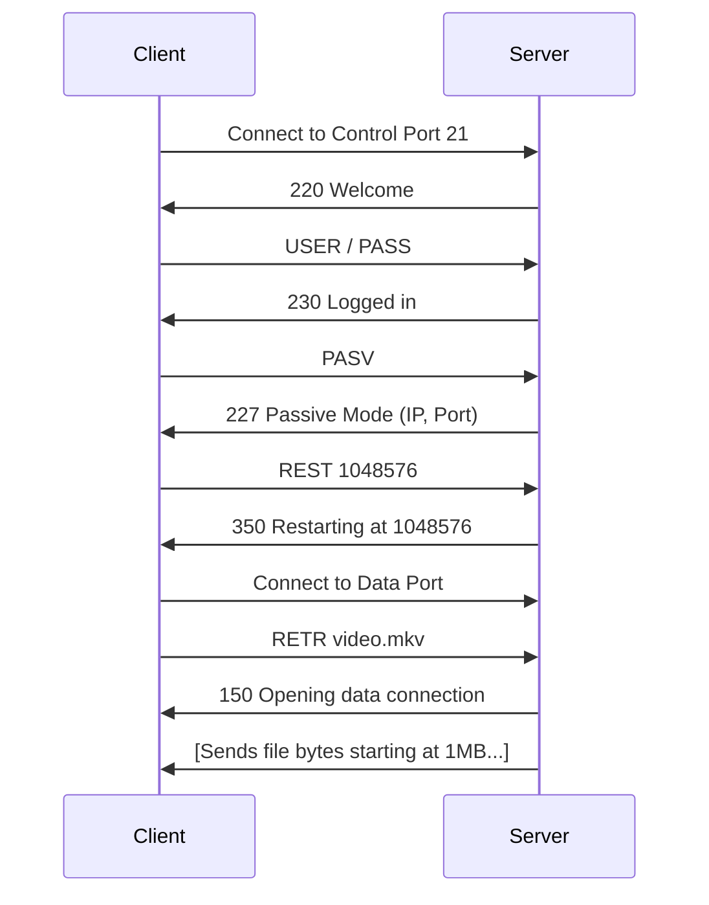

# Архитектура и Жизненный цикл клиента FTP в Movian

> **Провенанс.** Документ сверен с `src/fileaccess/fa_ftp.c` на `movian6` @ `80e6c3617`
> (2026-08-15). Каждый идентификатор, встречающийся ниже в обратных кавычках,
> был проверен на существование в исходнике; исправлено — имена полей `ftp_file_t`.
> Утверждения, которые не удалось подтвердить кодом, из документа удалены,
> а не смягчены.

FTP клиент реализован в модуле `fa_ftp.c` и предоставляет Movian встроенную поддержку протокола FTP для воспроизведения медиа и навигации по удаленным хранилищам через схемы `ftp://`.

Данный документ описывает внутреннюю архитектуру, декомпозицию ключевых компонентов и жизненный цикл клиентских сессий.

---

## 1. Архитектурная декомпозиция (Component Decomposition)

Компонентная структура клиента FTP разделена на следующие функциональные слои:

### 1.1. Слой интеграции с VFS (VFS Integration Layer)
Регистрирует схему `"ftp"` и экспортирует методы файлового доступа Movian.
* **Связанные структуры:** `fa_protocol_t fa_protocol_ftp` (определена в [fa_ftp.c:886](file:///home/uzver/repos/movian_ag/src/fileaccess/fa_ftp.c#L886)).
* **Регистрация протокола:** Осуществляется через автовызываемый конструктор `FAP_REGISTER(ftp)`.

### 1.2. Слой пула соединений (Connection Pool Layer)
Управляет списком кэшированных соединений `ftp_connections` для повторного использования сокетов.
* **Связанные переменные:** Глобальный список `ftp_connections` и мьютекс `ftp_global_mutex` (для обеспечения многопоточной безопасности).
* **Связанные функции:** `fc_connect`, `fc_disconnect`.

### 1.3. Слой сессии и управления командным каналом (Session & Control Layer)
Представляет логическое соединение с FTP-сервером и выполняет отправку управляющих команд и чтение статусных ответов.
* **Связанные структуры:** `ftp_connection_t` (хранит командный сокет `fc_tc`, имя хоста, порт, логин, пароль, статус авторизации, текущую папку на сервере и поддерживаемые расширения, флаг поддержки MLSD).
* **Связанные функции:** `fc_write` (отправка команды с завершением `\r\n`), `ftp_read_line` / `fc_read_result` (считывание многострочных статусных ответов FTP-сервера).

### 1.4. Слой передачи данных (Data Channel Layer)
Управляет открытием сокетов для передачи файлов или списков директорий.
* **Связанные функции:** `ftp_open_data_transfer()` (инициирует пассивный режим `PASV` / `EPSV` или активный режим `PORT` / `EPRT` и возвращает файловый дескриптор сокета передачи данных).

### 1.5. Слой открытых файловых дескрипторов (File I/O Layer)
Представляет открытый клиентом файл и транслирует запросы на чтение/позиционирование.
* **Связанные структуры:** `ftp_file_t` (содержит указатель на сессию `ff_fc`, сокет передачи данных `ff_xfer`, текущую позицию `ff_fpos` и размер `ff_size`).
* **Связанные функции:** `ftp_open`, `ftp_close`, `ftp_read`, `ftp_seek`, `ftp_fsize`, `ff_reconnect`.

---

## 2. Жизненный цикл соединений (Connection Lifecycle)

### Фаза 1: Инициализация (Startup)
* При запуске приложения вызывается функция инициализации `ftp_init()`, регистрируя схему `"ftp"`.

### Фаза 2: Установка соединения (Control Channel Connect)
* При запросе файла вызывается `ftp_open`. Происходит поиск активной сессии для данного хоста в пуле `ftp_connections`.
* Если сессия отсутствует:
  1. Выделяется `ftp_connection_t`.
  2. Устанавливается TCP соединение с сервером (обычно порт 21) через `tcp_connect()`.
  3. Считывается приветствие сервера, отправляется `USER` и `PASS`.
  4. С помощью команды `FEAT` опрашиваются возможности сервера (наличие поддержки кодировки UTF-8, команды `MLSD`).
  5. Сессия сохраняется в пуле.

### Фаза 3: Открытие канала данных (Data Channel Activation)
* Для передачи содержимого файла или списка каталогов вызывается [ftp_open_data_transfer](file:///home/uzver/repos/movian_ag/src/fileaccess/fa_ftp.c#L323).
* По умолчанию используется пассивный режим: отправляется команда `PASV`. Сервер возвращает IP и порт. Клиент устанавливает TCP-соединение с этим портом.
* После установки канала данных серверу отправляется управляющая команда передачи (например, `RETR file.mkv` или `MLSD`).
* Сокет данных привязывается к структуре `ftp_file_t` (`ff_xfer`).

### Фаза 4: Чтение данных (Active I/O)
* Функция `ftp_read` считывает байты из сокета данных `ff_xfer`.
* Если клиент запрашивает позиционирование `ftp_seek()`:
  1. Текущий канал данных закрывается.
  2. Отправляется команда `REST <offset>` в командный канал для указания смещения.
  3. Открывается новый канал данных через `ftp_open_data_transfer`.
  4. Посылается новая команда `RETR` для возобновления скачивания со смещением.

### Фаза 5: Очистка (Teardown)
* При закрытии файла (`ftp_close`) закрывается сокет передачи данных. Сессия командного канала возвращается в пул для повторного использования.
* При выходе из приложения или обнаружении ошибки сокета вызывается `fc_disconnect()`, закрывая командный канал и удаляя сессию из списка `ftp_connections`.
