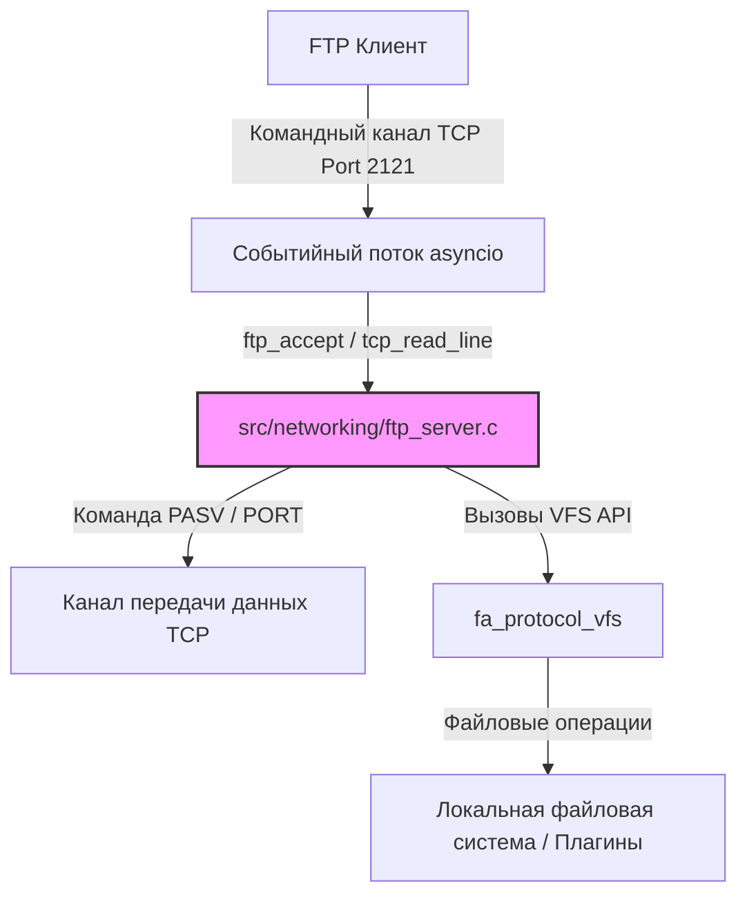
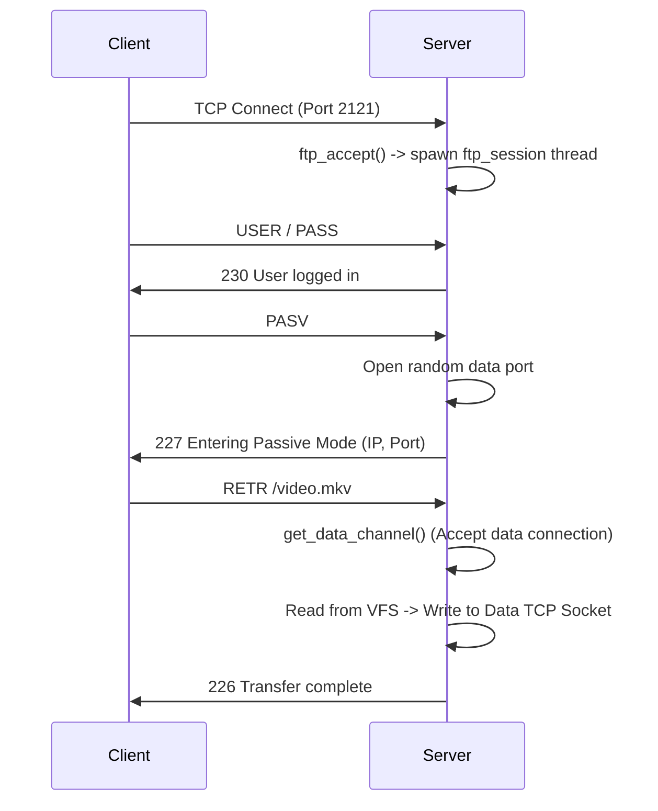

# Архитектура и Жизненный цикл встроенного FTP-сервера Movian

> **Провенанс.** Документ сверен с `src/networking/ftp_server.c` на `movian6` @ `80e6c3617`
> (2026-08-15). Каждый идентификатор, встречающийся ниже в обратных кавычках,
> был проверен на существование в исходнике; исправлено — имена настроек.
> Утверждения, которые не удалось подтвердить кодом, из документа удалены,
> а не смягчены.

Встроенный FTP-сервер Movian предоставляет удаленный доступ к локальной файловой системе и медиаресурсам VFS по стандартному протоколу FTP (RFC 959).

Данный документ описывает общую архитектуру, декомпозицию ключевых компонентов и полный жизненный цикл сервера.

---

## 1. Архитектурная декомпозиция (Component Decomposition)

Компонентная структура FTP-сервера состоит из следующих слоев:

### 1.1. Слой конфигурации и управления (Configuration Layer)
Регистрирует параметры FTP-сервера в настройках «Сеть» Movian и отслеживает изменения.
* **Связанные функции:** `ftp_server_init`, `set_enable`, `set_port`, `set_username`, `set_password`.
* **Переменные настроек:** `ftp_server_enable`, `ftp_server_port`, `ftp_username`, `ftp_password`.

### 1.2. Слой сетевого транспорта и событий (Network & Event Layer)
Обеспечивает прослушивание порта и прием входящих командных соединений через `asyncio`.
* **Связанные функции:** `enable_disable`, `ftp_accept`, `asyncio_listen`, `asyncio_del_fd`.

### 1.3. Слой сессии клиента (Session Control Layer)
Каждое клиентское подключение обрабатывается в собственном выделенном detached-потоке.
* **Связанные структуры:** `ftp_connection_t` (хранит состояние сессии: авторизация, рабочий каталог, тип передачи `TYPE I/A`, пассивный сокет `fc_accept_socket`, командный сокет `fc_tc`).
* **Фоновый поток сессии:** `ftp_session` запускается потоком с именем `FTP-session` через `hts_thread_create_detached`.

### 1.4. Слой обработки команд FTP (Command Processor Layer)
Парсит текстовые команды от клиента и вызывает соответствующие функции-обработчики.
* **Таблица команд:** Массив структур `ftpcmds` сопоставляет имена команд (например, `USER`, `PASV`, `RETR`) с их функциями и флагами прав доступа (`FTPCMD_AUTH_REQ`, `FTPCMD_NEED_ARGS`).

### 1.5. Слой трансляции VFS (VFS Translation Layer)
Обеспечивает выполнение файловых операций над VFS плеера.
* **Связанные функции:** `ftp_server_stat`, `ftp_server_open`, `ftp_server_makedirs`, `ftp_server_unlink`, `ftp_server_rmdir`, `ftp_server_rename`, `ftp_server_scandir`. Все вызовы перенаправляются в `fa_protocol_vfs`.

---

## 2. Жизненный цикл (Lifetime Lifecycle)

### Фаза 1: Инициализация (Startup)
1. При запуске Movian конструктор `INITME` вызывает `ftp_server_init()`.
2. Регистрируются сетевые настройки (`ftpserver.enable`, `ftpserver.port` и др.).
3. При изменении настроек срабатывает `enable_disable()`.

### Фаза 2: Активация сервера (Activation)
1. Если сервер включен (`ftp_server_enable`) и задан порт, вызывается `asyncio_listen()`.
2. Создается слушающий сокет `ftp_server_fd`, управляемый циклом `asyncio`.

### Фаза 3: Жизненный цикл сессии клиента (Client Session Lifecycle)

#### 1. Подключение и авторизация (Control Channel)
* При входящем соединении срабатывает `ftp_accept`.
* Выделяется `ftp_connection_t` и запускается поток `ftp_session`.
* Клиент отправляет `USER` и `PASS`. Происходит сверка с настроенными логином/паролем.

#### 2. Установка канала данных (Data Channel)
* Перед отправкой списка файлов (`LIST`) или передачей данных (`RETR`/`STOR`) клиент отправляет команду `PASV`.
* Сервер открывает временный порт для передачи данных, сохраняет сокет в `fc_accept_socket` и передает его адрес клиенту.
* Клиент подключается к порту данных, сервер принимает соединение в `get_data_channel()`.

#### 3. Передача файлов и навигация
* Клиент отправляет команды навигации (`CWD`, `PWD`) или файловые запросы. Сервер выполняет их на VFS-слое.

### Фаза 4: Отключение (Teardown)
1. Клиент посылает `QUIT` или закрывает сокет.
2. Поток `ftp_session` выходит из цикла обработки.
3. Закрываются все сокеты (командный сокет `fc_tc` и сокет передачи данных).
4. Освобождается выделенная под `ftp_connection_t` память.

### Фаза 5: Деактивация (Deactivation)
* При отключении сервера в настройках вызывается `asyncio_del_fd(ftp_server_fd)`. Слушающий сокет мгновенно удаляется из цикла `asyncio` без необходимости перезапуска приложения.
