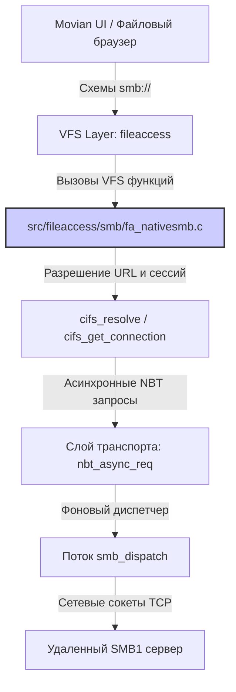

# Архитектура и Жизненный цикл клиента Native SMB (SMB1/CIFS) в Movian

> **Провенанс.** Документ сверен с `src/fileaccess/smb/fa_nativesmb.c` на `movian6` @ `80e6c3617`
> (2026-08-15). Каждый идентификатор, встречающийся ниже в обратных кавычках,
> был проверен на существование в исходнике; исправлено — имена структур и состояний.
> Утверждения, которые не удалось подтвердить кодом, из документа удалены,
> а не смягчены.

Клиент Native SMB реализован в модуле `fa_nativesmb.c` и предоставляет Movian встроенную поддержку протокола SMB1 (CIFS) для подключения к удаленным сетевым ресурсам по схемам `smb://`.

Данный документ описывает внутреннюю архитектуру, компонентную структуру и жизненный цикл соединений native-клиента.

---

## 1. Архитектурная декомпозиция (Component Decomposition)

Компонентная структура клиента Native SMB разделена на следующие функциональные слои:

### 1.1. Слой интеграции с VFS (VFS Integration Layer)
Регистрирует схему `"smb"` и экспортирует методы файлового доступа Movian.
* **Связанные структуры:** `fa_protocol_smb` (структура `fa_protocol_t`).
* **Макрос регистрации:** `FAP_REGISTER(smb)` расширяется в автовызываемый при старте конструктор `smb_init()`.

### 1.2. Слой разрешения путей и управления подключениями (Connection & Resolution Layer)
Управляет глобальным списком соединений `cifs_connections` и сопоставляет URL с сетевыми сессиями.
* **Связанные функции:** `cifs_resolve`, `cifs_get_connection`, `cifs_release_connection`, `cifs_disconnect`.
* **Связанные структуры:**
  * `cifs_connection_t`: Представляет TCP-соединение с хостом, хранит UID (`cc_uid`), мьютексы, списки ожидания пакетов, сессионный ключ и поддерживаемые сервером возможности (Unicode, шифрование).
  * `cifs_tree_t`: Представляет примонтированную шару (Tree Connect) с уникальным Tree ID (`ct_tid`).

### 1.3. Слой криптографии и аутентификации (Auth & Crypto Layer)
Реализует генерацию LM и NTLMv1 хешей для авторизации на сервере.
* **Связанные функции:** `NTLM_hash`, `des_key_spread`, `lmresponse`, `lmresponse_round`, `smb_setup_andX`.

### 1.4. Слой асинхронного транспорта и диспетчеризации (Transport & Dispatcher Layer)
Обеспечивает мультиплексирование запросов по одному TCP-соединению без блокировки основного потока.
* **Связанные структуры:** `nbt_req_t` (представляет отправленный асинхронный запрос NBT с уникальным Multiplex ID `mid`).
* **Фоновый поток:** Функция `smb_dispatch` запускается в потоке `SMB` при переходе соединения в рабочий статус. Она читает сырые пакеты из TCP сокета, сопоставляет их по `mid` с ожидающими NBT-запросами из списка `cc_pending_nbt_requests`, и будит ждущие потоки.

---

## 2. Жизненный цикл соединений (Connection Lifecycle)

Жизненный цикл соединения Native SMB состоит из следующих фаз:

### Фаза 1: Регистрация и Инициализация (Startup)
* При старте Movian макрос `FAP_REGISTER(smb)` регистрирует протокол в глобальном списке.
* Инициализируется глобальный мьютекс `smb_global_mutex`.

### Фаза 2: Разрешение URL и Подключение (Resolution & TCP Connect)
* При обращении к `smb://host/share/path` вызывается [cifs_resolve](file:///home/uzver/repos/movian_ag/src/fileaccess/smb/fa_nativesmb.c#L1423).
* Выполняется поиск существующего соединения в списке `cifs_connections`.
* Если соединение не найдено:
  1. Выделяется память под `cifs_connection_t`, статус устанавливается в `CC_CONNECTING`.
  2. Устанавливается TCP соединение через `tcp_connect()`.
  3. Отправляется запрос согласования протокола `smb_neg_proto()`.
  4. Запускается сессия `smb_setup_andX()`. Сначала сервер опрашивается под видом гостя (`CC_F_AS_GUEST`). Если гостевой вход закрыт и требуется авторизация, возвращается `SAMBA_NEED_AUTH`, инициируя запрос пароля из keyring.
  5. При успешной авторизации статус меняется на `CC_RUNNING`. Запускается фоновый поток `smb_dispatch` и таймер периодического эхо-запроса `cifs_periodic` (каждые 15 секунд).

### Фаза 3: Монтирование шары (Tree Connect)
* Вызывается `smb_tree_connect_andX()` для монтирования целевой папки шары.
* Создается структура `cifs_tree_t` в статусе `CT_CONNECTING`.
* После ответа сервера статус переходит в `CT_RUNNING`.

### Фаза 4: Чтение и Запись (Active I/O)
* При открытии файла создается `smb_file_t`, содержащий дескриптор `sf_fid`.
* Чтение данных (`smb_read`) выполняется блоками (не более 56KB). Несколько блоков могут запрашиваться параллельно-асинхронно через очередь `nbt_async_req`, ускоряя скачивание.

### Фаза 5: Разрыв и Очистка (Teardown)
* При закрытии файлов (`smb_close`) отправляется пакет `SMB_CLOSE`, дескриптор `sf_fid` освобождается.
* При разрыве соединения сокет закрывается, соединение помечается как `cc_broken`, статус переходит в `CC_ERROR` / `CC_ZOMBIE`.
* Поток `smb_dispatch` завершает работу, а вызов `cifs_release_connection` освобождает всю память.
