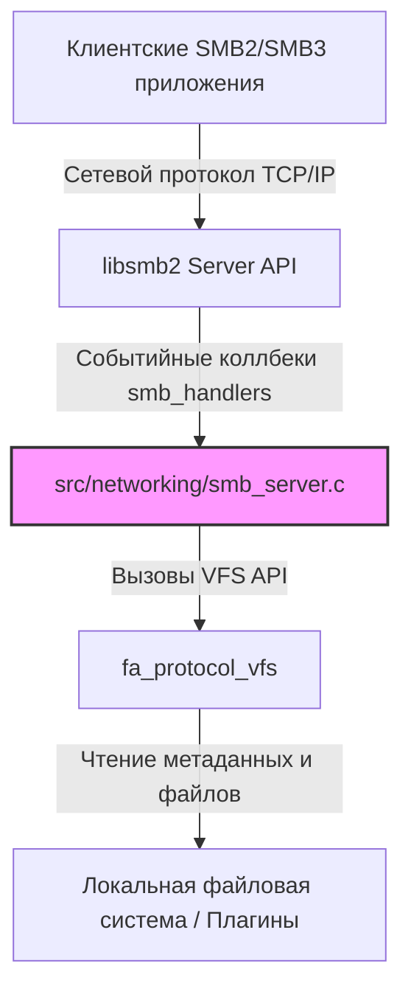
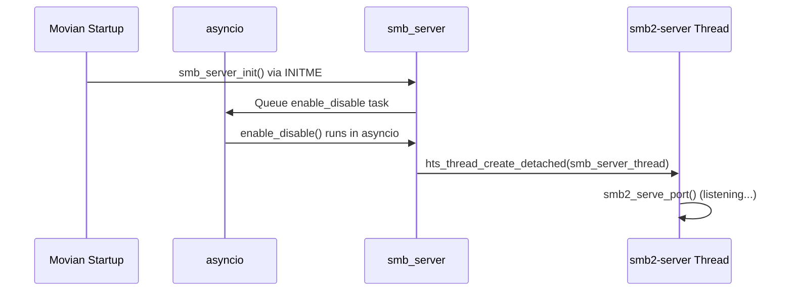
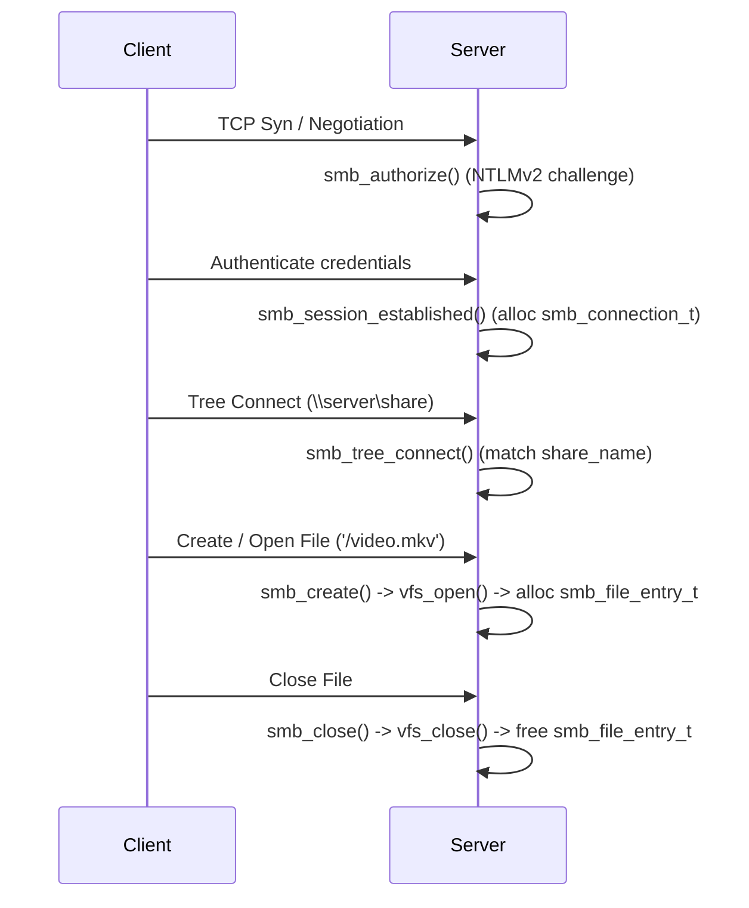

# Архитектура и Жизненный цикл встроенного SMB-сервера Movian

Встроенный SMB-сервер Movian реализован на базе библиотеки `libsmb2` (версии 6.2+) и предоставляет сетевой доступ к локальным VFS-ресурсам медиаплеера по протоколам SMB2/SMB3.

Данный документ описывает общую архитектуру, декомпозицию ключевых компонентов и полный жизненный цикл сервера.

---

## 1. Архитектурная декомпозиция (Component Decomposition)

Компонентная структура сервера разделена на четыре слоя взаимодействия:

### 1.1. Настройки и управление запуском (Configuration Layer)
Регистрирует параметры сервера в системных настройках Movian и отслеживает их изменение через Courier.
* **Связанные функции:** `smb_server_init`, `set_enable`, `set_port`, `set_username`, `set_password`, `set_share_name`, `set_share_root`.
* **Переменные конфигурации:** `smb_enable`, `smb_port`, `smb_username`, `smb_password`, `smb_share_name`, `smb_share_root`.

### 1.2. Сетевой и потоковый слой (Network Layer)
Обеспечивает прослушивание порта и выполнение основного цикла обработки в отдельном потоке.
* **Связанные функции:** `enable_disable`, `smb_server_thread`, `smb2_serve_port`.
* **Потоковая модель:** Поток `smb2-server` создается как detached-поток с помощью `hts_thread_create_detached` с приоритетом `THREAD_PRIO_MODEL`.

### 1.3. Слой сессий и авторизации (Session & Auth Layer)
Управляет сессиями клиентов, аутентификацией и разграничением доступа.
* **Связанные структуры:** `smb_connection_t`.
* **Связанные функции:** `smb_authorize`, `smb_session_established`, `smb_logoff`, `smb_destruction`.

### 1.4. Слой управления файловыми дескрипторами (File & Resource Mapping)
Сопоставляет 16-байтовые SMB2 File ID с дескрипторами Movian VFS (`fa_handle_t` и `fa_dir_t`).
* **Связанные структуры:** `smb_file_entry_t`.
* **Связанные функции:** `smb_alloc_file`, `smb_find_file`, `smb_free_file`, `smb_encode_file_id`, `smb_decode_file_idx`, `smb_decode_file_gen`.

### 1.5. Слой трансляции операций (VFS Translation Layer)
Реализует непосредственные файловые операции, транслируя SMB2 запросы в вызовы функций `fa_protocol_vfs`.
* **Связанные функции:** `smb_create`, `smb_close`, `smb_read`, `smb_write`, `smb_query_directory`, `smb_query_info`, `smb_set_info`.

---

## 2. Жизненный цикл (Lifetime Lifecycle)

Жизненный цикл встроенного SMB-сервера состоит из 5 фаз:

### Фаза 1: Инициализация при старте приложения (Startup)
1. На этапе запуска подсистемы `asyncio` срабатывает конструктор `INITME(INIT_GROUP_ASYNCIO, smb_server_init, NULL, 0)`.
2. Функция [smb_server_init](file:///home/uzver/repos/movian_ag/src/networking/smb_server.c#L1560) добавляет группу настроек в раздел «Сеть» системного меню Movian.
3. Настройки считываются из хранилища (`persistent/settings/network`).
4. При считывании настроек срабатывают коллбеки настроек (`set_enable`, `set_port` и др.), которые вызывают `queue_enable_disable()`.

### Фаза 2: Запуск сервера (Activation)
1. `queue_enable_disable` отсылает асинхронную задачу `deferred_enable_disable` в поток `asyncio` через `asyncio_run_task()`.
2. Функция `enable_disable()` проверяет флаг включения `smb_enable` и порт `smb_port`.
3. Выделяется память под `struct smb2_server` (хранит хендлеры `smb_handlers`, порт и настройки авторизации).
4. Запускается поток `smb2-server` через `hts_thread_create_detached`, выполняющий функцию [smb_server_thread](file:///home/uzver/repos/movian_ag/src/networking/smb_server.c#L1452).
5. Поток блокируется в функции `smb2_serve_port()`, которая открывает сокет и переходит в `select()` для ожидания входящих подключений.

### Фаза 3: Жизненный цикл сессии клиента (Client Session Lifecycle)

#### 1. Подключение и Авторизация
* При подключении клиента `libsmb2` принимает сокет и вызывает `.authorize_user` (`smb_authorize`).
* Если включена авторизация по паролю, проверяется совпадение имени пользователя. Пароль передается обратно в `libsmb2` с помощью `smb2_set_password()`, которая завершает проверку NTLMv2-хеша.

#### 2. Создание сессии
* После успешной аутентификации вызывается `.session_established` (`smb_session_established`).
* Создается структура `smb_connection_t`, инициализируется путь экспортируемой шары (`sc_share_root`) и связывается с сессией `libsmb2` через `opaque`-поле.
* Настройка `smbserver.root="/"` нормализуется в `vfs:///`, поэтому корень SMB-шары совпадает с FTP/VFS export. Явные `vfs://...`, `file://...` и абсолютные filesystem paths сохраняют ожидаемую область экспорта.

#### 3. Подключение шары (Tree Connect)
* При запросе монтирования (например, `\\server\share`) вызывается `.tree_connect_cmd` (`smb_tree_connect`), проверяя соответствие имени шары системной настройке `smb_share_name`.
* Для host-root navigation `smb2://host:port/` клиент монтирует `IPC$`, открывает pipe `srvsvc` и выполняет DCE/RPC `NetrShareEnum`. Сервер возвращает только настроенную disk share; autodiscovery соседних машин не является частью этого потока.

#### 4. Обмен файловыми операциями
* Клиент отправляет файловые операции (`create`, `read`, `write`, `close`, `query_directory`).
* Каждый открытый файл резервирует свободный слот в массиве `sc_files` (размером до `SMB2_MAX_FILES` = 64). Хендлы сопоставляются через кодируемый 16-байтовый PDU File ID.

### Фаза 4: Отключение клиента (Teardown)
1. При штатном выходе вызывается `.logoff_cmd` (`smb_logoff`).
2. При неожиданном разрыве связи срабатывает `.destruction_event` (`smb_destruction`), перенаправляя вызов в `smb_logoff`.
3. Все незакрытые дескрипторы файлов в текущей сессии освобождаются функцией `smb_close_all_files()`.
4. Удаляется объект `smb_connection_t` и освобождается память.

### Фаза 5: Остановка сервера (Deactivation)
* Так как `smb2_serve_port` блокирует поток в закрытом цикле прослушивания и не имеет штатного API для принудительного закрытия сокета извне, изменение порта или отключение сервера в настройках требует перезапуска приложения Movian. При попытке отключения сервера выводится лог: `"SMB2 server disable requested; restart required to stop listener"`.

---

## 3. Модель хранения и кэширования файловых хэндлов

* **Максимальное количество дескрипторов:** `SMB2_MAX_FILES` = 64 дескриптора на одно соединение.
* **Массив дескрипторов:** `sc_files` в структуре `smb_connection_t`. Слот считается свободным, если `fe->path == NULL`.
* **Уникальность File ID:** Для предотвращения ошибок использования устаревших File ID (когда клиент посылает запросы к закрытому хендлу, на место которого был выделен новый), используется 32-битный глобальный счетчик поколений `sc_gen`. При каждом новом выделении слота `sc_gen` инкрементируется и кодируется в File ID. При входящем запросе проверяется совпадение дескриптора и поколения.
* **Related compound File ID:** `libsmb2` client использует all-`FF` File ID в related compound chains (`CREATE + QUERY_INFO + CLOSE`). Сервер хранит последний созданный File ID в `smb_connection_t` и резолвит all-`FF` placeholder в этот handle. Это необходимо для корректного `stat()` директорий и дальнейшего browse `share/zona/`.
